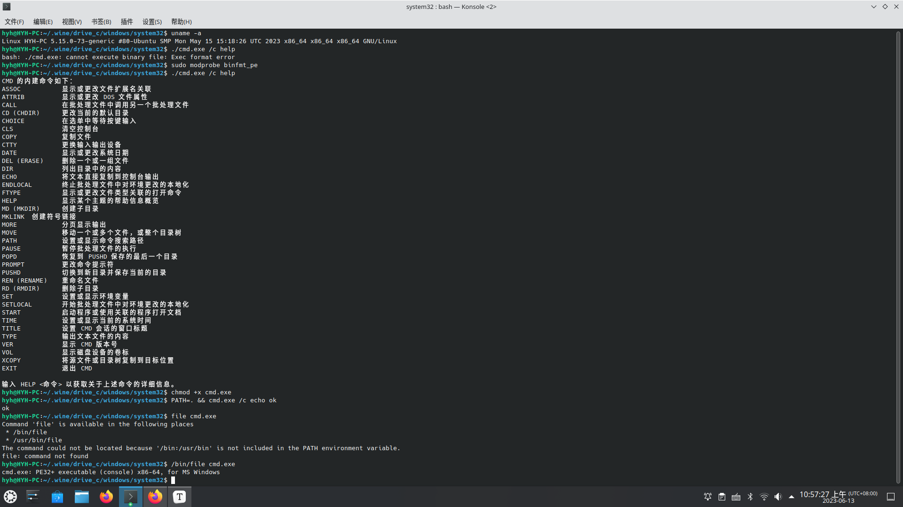

# 说明

在Linux下虽然可以通过wine执行windows的PE格式程序，但需要手动调用wine命令。于是参考Linux内核中脚本的调用方式，直接执行PE可执行文件。

本仓库为Linux模块工程，仅供测试。

若未特殊说明，默认测试的操作系统为ubuntu22.04.

## 使用条件

- [wine](https://www.winehq.org/)：在/usr/bin目录下必须包含wine。

## 自动启动

当binfmt_pe模块正常编译安装后,可通过将binfmt_pe写入/etc/modules实现自动启动。

# 编译安装

注意：需要先安装以下软件包以支持编译使用：

```bash
sudo apt-get install build-essential make dkms wine
```

本工程由dkms管理,编译安装如下：

```bash
#dkms添加
sudo dkms add .
#dkms安装
sudo dkms install binfmt_pe/0.1

```

# 测试截图

